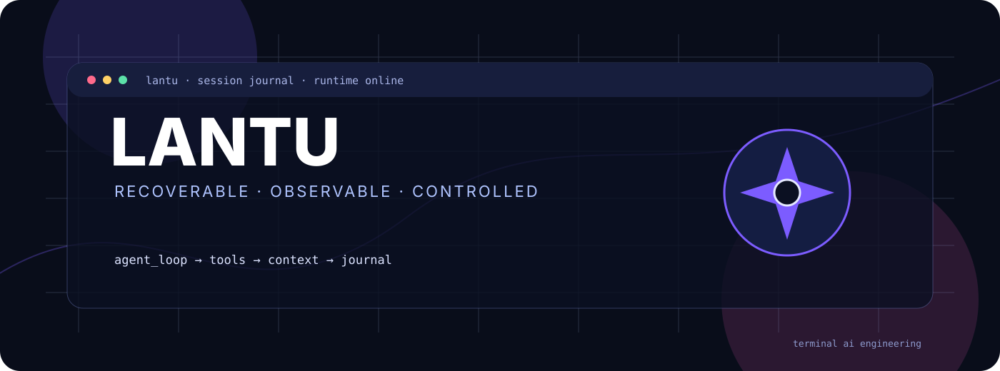
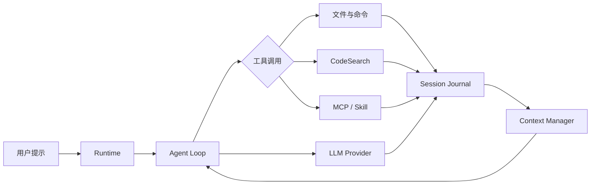
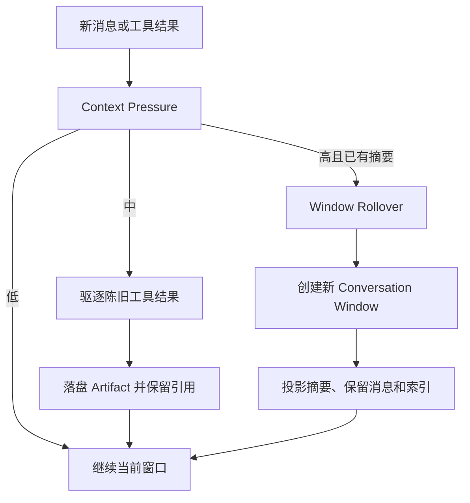
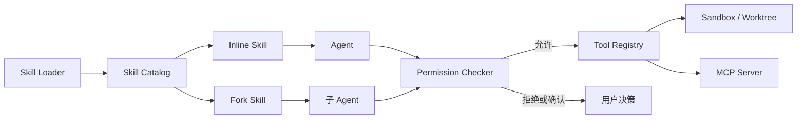

# Lantu

<p align="center"></p>
<p align="center"><strong>Recoverable · Observable · Controlled</strong></p>

Lantu 是一个可运行的终端 AI 编程 Agent。项目以清晰、可验证的实现展示 Agent 主循环、工具调用、权限控制、上下文生命周期和会话持久化，同时提供交互式终端、非交互执行和远程 Web 界面。

## 核心能力

- Agent 主循环：支持文本响应、思考内容、工具调用和多轮执行。
- 多 Provider：支持 Anthropic、OpenAI Responses API，以及 OpenAI-compatible Chat Completions API。
- 工具系统：文件读写、命令执行、CodeSearch、MCP、工具搜索和渐进式工具加载。
- 上下文管理：陈旧工具结果驱逐、结构化摘要、上下文压力检测和 Window Rollover。
- Session Journal：持久化运行事件、工具状态、上下文变化、窗口切换和恢复信息。
- 恢复与审计：支持中断恢复、工具结果引用、Session 诊断和运行证据导出。
- 权限与隔离：支持权限模式、危险命令检测、路径规则、Sandbox、Hooks 和 Git worktree。
- Skill 与 Agent：支持项目级和用户级 Skill、Fork 型 Skill、子 Agent、Agent Team 和后台任务。
- 运行界面：提供内联终端、非交互模式、远程 Web 模式和 Lens 只读观测界面。

Lantu 的核心目标不只是完成一次模型请求，而是让 Agent 在较长任务中保持可恢复、可观察和可控：会话可以持久化，旧工具结果可以落盘，上下文压力可以触发局部压缩或窗口切换，运行过程可以通过 Lens 检查、搜索、诊断和回放。

## 工作方式

```text
CLI / Remote UI → Runtime → Agent Loop
                         ├── LLM Client
                         ├── Tools / MCP / Skills
                         ├── Permissions / Sandbox
                         ├── Context Manager
                         └── Session Journal
```

模型通过统一的工具注册表访问文件、命令、MCP 和代码检索能力。Agent 的消息、工具状态和上下文变化写入 Session Journal；Context Manager 根据上下文压力选择局部驱逐、结构化摘要或窗口切换。

### 运行链路



### 上下文压力与窗口切换



### Skill、工具与权限边界



## 技术栈

- Python 3.11+
- `uv`（依赖和可编辑安装）
- Rich / prompt_toolkit
- Anthropic SDK / OpenAI SDK / OpenAI-compatible API
- MCP
- pytest

## 安装与启动

```bash
uv sync
uv run lantu
```

如果希望在任意项目目录使用当前仓库版本：

```bash
uv tool install --editable /path/to/lantu
cd /path/to/your-project
lantu
```

执行命令时所在的目录就是 Agent 的工作目录。

非交互执行和远程模式：

```bash
uv run lantu -p "介绍当前项目"
uv run lantu -p "检查测试状态" --output-format stream-json
uv run lantu --remote
```

远程模式默认监听 `0.0.0.0:18888`，浏览器访问 `http://localhost:18888`。交互模式支持 `/help`、`/model`、`/thinking`、`/tools`、`/mcp`、`/skill`、`/memory`、`/compact`、`/session`、`/rewind`、`/permission`、`/plan`、`/status`、`/exit` 和 `/quit`。

## 配置

配置文件按以下顺序加载：

```text
~/.lantu/config.yaml              全局配置
当前目录/.lantu/config.yaml       项目配置
当前目录/.lantu/config.local.yaml 本机私有覆盖
```

项目配置会覆盖全局配置；其中 `providers` 是整体替换，其他配置项按字段合并。示例：

```yaml
providers:
  - name: deepseek
    protocol: openai-compat
    base_url: https://api.deepseek.com
    model: deepseek-v4-pro
    api_key: ${OPENAI_API_KEY}
    thinking: false
    context_window: 1048576
    max_output_tokens: 32768

permission_mode: default

mcp_servers:
  - name: context7
    command: npx
    args: ["-y", "@upstash/context7-mcp"]
```

`openai-compat` 表示通过 OpenAI 兼容的 Chat Completions 接口访问第三方 Provider；`openai` 表示 OpenAI 官方 Responses API。思考生成由 Provider 的 `thinking` 或 `reasoning_effort` 控制，前端展示由 `ui.show_thinking` 独立控制。API Key 也可以直接写入配置文件，但包含真实密钥的文件不应提交到 Git。

## CodeSearch 与 MCP

模型通过 `CodeSearch` 定位代码，再通过 `ReadFile` 等工具验证当前文件内容。Lantu 不在启动时扫描整个仓库，也不把完整 RepoMap 注入 System Prompt。

zvec-grep 是可选的本地 MCP 搜索服务。未启用或连接失败时，CodeSearch 会按降级链使用官方 `rg` 和内置 Grep；`.zvec-grep/` 是本地派生索引，不提交到 Git。

## Session Journal 与 Lens

每个工作目录的 `.lantu/sessions/` 保存运行生命周期、消息、工具调用、上下文压缩、窗口切换、恢复和验证事件。

```bash
lantu lens list
lantu lens events <session_id>
lantu lens search <session_id> "关键字"
lantu lens diagnose <session_id>
lantu lens compare <left_session_id> <right_session_id>
lantu lens export <session_id> output.jsonl
lantu lens web
```

Window Rollover 会在上下文压力较高且当前会话已有摘要时创建新的 Conversation Window。Session ID 保持不变，旧窗口仍保留在 Journal 中。

## Skill、权限与隔离

```text
当前目录/.lantu/skills/       项目级 Skill，优先级更高
~/.lantu/skills/               用户级 Skill
```

权限默认采用 `default` 模式，也可以选择 `acceptEdits`、`plan` 和 `bypassPermissions`。项目还支持路径权限规则、危险命令检测、可选 Sandbox、Hooks 以及 Git worktree 隔离。

## 测试与验证

```bash
uv run pytest
uv run python bench/lantu_validate.py
```

结果写入 `bench/results/lantu_validation.json` 和 `bench/results/lantu_validation.txt`。真实 Provider 缓存、Window Rollover、CodeSearch、A/B 和 Terminal-Bench 记录位于 [`project-records/2026-09-29/`](project-records/2026-09-29/)，功能验收日志位于 [`docs/development-validation-log.md`](docs/development-validation-log.md)。最近一次 Lens 窗口功能回归结果为 `1004 passed, 14 skipped`。

## 目录结构

```text
lantu/              Agent、Runtime、Context、Tools、MCP、Skills 和 UI 实现
tests/              Python 自动化测试
bench/              缓存、上下文和检索验证脚本
docs/               设计、研究、验收和开发记录
project-records/    测试结果与运行记录归档
.lantu/skills/      当前项目的项目级 Skill
```

## 当前限制

- 跨 Session handoff 尚未实现。
- 真实缓存命中率受 Provider 缓存状态、请求内容和窗口边界影响，不是固定性能承诺。
- Provider 对思考内容、工具调用、缓存统计和上下文窗口的支持存在差异。
- zvec-grep 需要额外的本地服务和索引；降级路径不提供完全相同的语义检索能力。
- 远程模式默认监听所有网卡，生产或共享网络环境中应自行增加访问控制。
